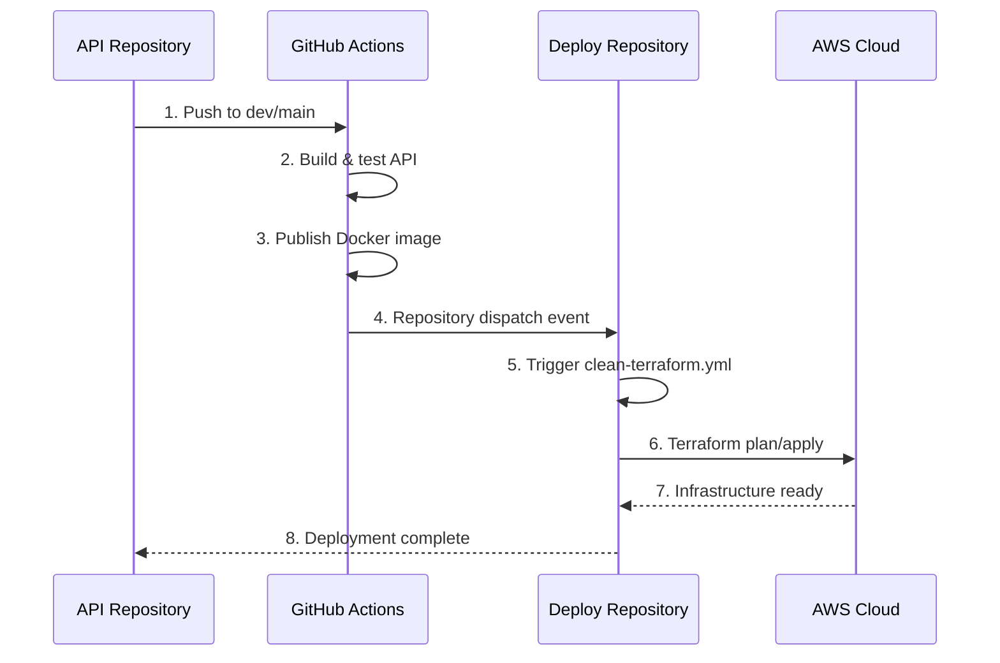

# 🚀 Guest List Deploy - DevSecOps Infrastructure

**Course:** DevSecOps  
**Team Members:** Gili, Sivan, Sahar, Dvir  
**Presenters:** Sivan & Dvir

Complete Infrastructure-as-Code deployment for the Guest List API using Terraform, AWS EKS, and Kubernetes with automated CI/CD pipelines supporting multiple environments.

## 📋 Table of Contents

- [Project Overview](#-project-overview)
- [Infrastructure Architecture](#-infrastructure-architecture)
- [Environment Strategy](#-environment-strategy)
- [Technology Stack](#-technology-stack)
- [Repository Structure](#-repository-structure)
- [Deployment Workflow](#-deployment-workflow)
- [AWS Resources](#-aws-resources)
- [Kubernetes Configuration](#-kubernetes-configuration)
- [CI/CD Pipeline](#-cicd-pipeline)
- [Environment Management](#-environment-management)
- [Local Development](#-local-development)
- [Security & Best Practices](#-security--best-practices)
- [Monitoring & Observability](#-monitoring--observability)
- [Cost Optimization](#-cost-optimization)
- [Troubleshooting](#-troubleshooting)

## 🎯 Project Overview

This repository contains the complete infrastructure deployment configuration for our Guest List API project. It demonstrates advanced DevSecOps practices including Infrastructure as Code, automated deployment pipelines, and multi-environment management using industry-standard tools.

**Key Capabilities:**
- **Multi-Environment Deployment:** Individual student environments plus shared dev/prod
- **Infrastructure as Code:** Complete AWS infrastructure managed through Terraform
- **Container Orchestration:** Kubernetes deployment on AWS EKS
- **Automated CI/CD:** GitHub Actions with cross-repository integration
- **Security:** IAM roles, security groups, and encrypted state management
- **Scalability:** Auto-scaling groups and load balancing

## 🏗️ Infrastructure Architecture

```
                                    AWS Cloud Environment
    ┌─────────────────────────────────────────────────────────────────────────────────┐
    │                                                                                 │
    │   ┌─────────────────┐                            ┌─────────────────────────┐   │
    │   │   VPC Network   │                            │     DynamoDB Tables     │   │
    │   │                 │                            │                         │   │
    │   │  ┌──────────┐   │     ┌──────────────────┐   │  ┌─────────────────┐    │   │
    │   │  │Public    │   │     │                  │   │  │ GuestList-gili  │    │   │
    │   │  │Subnets   │───┼────▶│  EKS Cluster     │◀──┼──│ GuestList-sivan │    │   │
    │   │  │(2x AZs)  │   │     │                  │   │  │ GuestList-sahar │    │   │
    │   │  └──────────┘   │     │ ┌─────────────┐  │   │  │ GuestList-dvir  │    │   │
    │   │                 │     │ │Worker Nodes │  │   │  │ GuestList-dev   │    │   │
    │   │  ┌──────────┐   │     │ │(t3.small)   │  │   │  │ GuestList-main  │    │   │
    │   │  │Private   │───┼─────│ │Auto Scaling │  │   │  └─────────────────┘    │   │
    │   │  │Subnets   │   │     │ └─────────────┘  │   │                         │   │
    │   │  │(2x AZs)  │   │     └──────────────────┘   └─────────────────────────┘   │
    │   │  └──────────┘   │              │                                           │
    │   │                 │              │                                           │
    │   │  ┌──────────┐   │     ┌────────▼─────────┐                                │
    │   │  │Internet  │───┼─────│ Load Balancer    │                                │
    │   │  │Gateway   │   │     │ (ALB/Classic)    │                                │
    │   │  └──────────┘   │     └──────────────────┘                                │
    │   │                 │                                                         │
    │   └─────────────────┘                                                         │
    │                                                                               │
    └─────────────────────────────────────────────────────────────────────────────────┘

    ┌─────────────────────────────────────────────────────────────────────────────────┐
    │                        CI/CD Pipeline Flow                                     │
    │                                                                                 │
    │  ┌──────────────┐    ┌──────────────┐    ┌──────────────┐    ┌─────────────┐  │
    │  │Guest-List-API│────▶│GitHub Actions│────▶│Docker Hub    │    │AWS EKS      │  │
    │  │Repository    │    │CI/CD         │    │Image Registry│    │Deployment   │  │
    │  │              │    │              │    │              │    │             │  │
    │  │- Code Push   │    │- Build Test  │    │- Tagged      │    │- Rolling    │  │
    │  │- Branch Merge│    │- Integration │    │  Images      │    │  Updates    │  │
    │  │              │    │- Publish     │    │              │    │- Health     │  │
    │  └──────────────┘    └──────┬───────┘    └──────────────┘    │  Checks     │  │
    │                             │                                │             │  │
    │  ┌──────────────┐    ┌──────▼───────┐    ┌──────────────┐    │             │  │
    │  │Guest-List    │◀───│Repository    │    │Terraform     │────▶│             │  │
    │  │Deploy Repo   │    │Dispatch      │    │Apply         │    │             │  │
    │  │              │    │              │    │              │    │             │  │
    │  │- Terraform   │    │- Cross-repo  │    │- Provision   │    └─────────────┘  │
    │  │- K8s Configs │    │  Triggers    │    │- Deploy      │                     │
    │  │- Automation  │    │- Environment │    │- Update      │                     │
    │  └──────────────┘    └──────────────┘    └──────────────┘                     │
    └─────────────────────────────────────────────────────────────────────────────────┘
```

## 🌍 Environment Strategy

We implement a comprehensive multi-environment strategy supporting both individual development and shared environments:

```
Development Flow:
┌─────────────────┐    ┌─────────────────┐    ┌─────────────────┐
│ Student Feature │    │   Integration   │    │   Production    │
│  Environments   │    │   Environment   │    │   Environment   │
│                 │    │                 │    │                 │
│  ┌───────────┐  │    │  ┌───────────┐  │    │  ┌───────────┐  │
│  │   gili    │  │    │  │    dev    │  │    │  │   main    │  │
│  ├───────────┤  │────▶  ├───────────┤  │────▶  ├───────────┤  │
│  │   sivan   │  │    │  │  Shared   │  │    │  │Production │  │
│  ├───────────┤  │    │  │ Testing   │  │    │  │ Stable    │  │
│  │   sahar   │  │    │  │ Integration│  │    │  │ Release   │  │
│  ├───────────┤  │    │  └───────────┘  │    │  └───────────┘  │
│  │   dvir    │  │    │                 │    │                 │
│  └───────────┘  │    └─────────────────┘    └─────────────────┘
└─────────────────┘
```

**Environment Configuration:**
- **Individual (gili, sivan, sahar, dvir):** Personal development and testing
- **dev:** Shared integration environment for team collaboration
- **main:** Production environment for stable releases

## 🛠️ Technology Stack

**Infrastructure & Orchestration:**
- **Terraform** v1.9.8 - Infrastructure as Code
- **AWS EKS** v1.28 - Kubernetes cluster management
- **Kubernetes** - Container orchestration
- **Docker** - Containerization platform

**AWS Services:**
- **EKS** - Managed Kubernetes service
- **DynamoDB** - NoSQL database
- **VPC** - Virtual Private Cloud networking
- **IAM** - Identity and Access Management
- **S3** - Terraform state storage
- **EC2** - Worker node instances

**CI/CD & Automation:**
- **GitHub Actions** - Pipeline automation
- **S3 + DynamoDB** - Terraform remote state management
- **Repository Dispatch** - Cross-repo communication

## 📁 Repository Structure

```
Guest-List-Deploy/
├── backend.tf                 # Terraform remote state configuration
├── main.tf                    # VPC, subnets, networking infrastructure  
├── eks.tf                     # EKS cluster and node group definitions
├── dynamodb.tf                # DynamoDB table resources
├── kubernetes.tf              # Kubernetes deployments and services
├── variables.tf               # Input variables and configuration
├── outputs.tf                 # Infrastructure outputs and endpoints
├── provider.tf                # AWS provider configuration
├── state-bucket.tf            # S3 state bucket creation (optional)
├── iam.tf                     # IAM roles and policies (commented)
├── .github/workflows/
│   └── clean-terraform.yml    # CI/CD pipeline for deployment
├── manifests/
│   ├── guestlistapi-LB-service.yaml      # Load balancer service
│   └── guestlistapideploy.yaml.tftpl     # Deployment template
└── .gitignore                 # Git ignore patterns
```

## 🔄 Deployment Workflow

### Cross-Repository Integration

Our deployment process integrates seamlessly with the API repository:

1. **API Development:**
   ```bash
   # Developer pushes to feature branch
   git push origin sivan-feature-authentication
   
   # CI builds and tests in Guest-List-API
   # Image tagged as sivanmonshi/guestlistapi:sivan-feature-abc123
   ```

2. **Integration Testing:**
   ```bash
   # Merge to dev branch triggers deployment
   git push origin dev
   
   # Repository dispatch sent to Guest-List-Deploy
   # Terraform plan executed for dev environment
   ```

3. **Production Deployment:**
   ```bash
   # PR merge to main triggers production deployment
   git push origin main
   
   # Repository dispatch sent to Guest-List-Deploy  
   # Terraform apply executed for main environment
   ```

### Complete Pipeline Trigger Matrix

| Trigger Source | Event Type | Environment | Docker Image Resolution | Terraform Operation | Description |
|---------------|------------|-------------|------------------------|-------------------|-------------|
| **API Repository** | Push to `dev` | `dev` | `dev` tag | `terraform plan` | Integration testing deployment |
| **API Repository** | Push to `main` | `main` | `latest` tag | None | Production image build only |
| **API Repository** | PR to `main` | `main` | `latest` tag | `terraform apply` | Production deployment |
| **API Repository** | Manual `dev` | `dev` | `dev` tag | `terraform plan` | Manual dev planning |
| **API Repository** | Manual `main` | `main` | `latest` tag | `terraform apply` | Manual production deployment |
| **Deploy Repository** | Manual dispatch | Any | Latest available | `plan`/`apply`/`destroy` | Direct infrastructure management |
| **Deploy Repository** | PR to main | N/A | N/A | `terraform plan` | Infrastructure change preview |

### Repository Dispatch Integration

| API Event | Dispatch Type | Deploy Action | Payload | Result |
|-----------|--------------|---------------|---------|--------|
| Push to `dev` branch | `deploy_plan` | Plan infrastructure | `{"environment": "dev"}` | Dev environment planning |
| Manual run with `dev` | `deploy_plan` | Plan infrastructure | `{"environment": "dev"}` | Dev environment planning |
| PR to `main` branch | `deploy_apply` | Apply infrastructure | `{"environment": "main"}` | Production deployment |
| Manual run with `main` | `deploy_apply` | Apply infrastructure | `{"environment": "main"}` | Production deployment |

### Cross-Repository Webhook Flow



### Environment-Specific Triggers

| Environment | Trigger Source | Image Tag Pattern | Auto-Deploy | Manual Override |
|-------------|---------------|------------------|-------------|----------------|
| `gili` | Manual only | `gili-feature-*` | No | Yes |
| `sivan` | Manual only | `sivan-feature-*` | No | Yes |
| `sahar` | Manual only | `sahar-feature-*` | No | Yes |
| `dvir` | Manual only | `dvir-feature-*` | No | Yes |
| `dev` | API push/manual | `dev` | Yes | Yes |
| `main` | API PR/manual | `latest` | Yes | Yes |

## ☁️ AWS Resources

### Networking Infrastructure
```hcl
# VPC with public and private subnets across 2 AZs
VPC: 10.0.0.0/16
├── Public Subnets:  10.0.1.0/24, 10.0.2.0/24
├── Private Subnets: 10.0.10.0/24, 10.0.11.0/24
├── Internet Gateway: Internet access for public subnets
├── NAT Gateway: Outbound internet for private subnets  
└── Route Tables: Traffic routing configuration
```

### EKS Cluster Configuration
```yaml
Cluster:
  name: guestlist-cluster
  version: "1.28"
  endpoint_access:
    private: true
    public: true
  logging: ["api", "audit"]

Node Group:
  instance_type: t3.small
  capacity:
    min: 1
    desired: 2  
    max: 3
  subnets: private_subnets
```

### DynamoDB Tables
```
Table Pattern: GuestList-{environment}
Examples:
- GuestList-gili
- GuestList-sivan  
- GuestList-sahar
- GuestList-dvir
- GuestList-dev
- GuestList-main
```

## ⚙️ Kubernetes Configuration

### Namespace Structure
```yaml
apiVersion: v1
kind: Namespace
metadata:
  name: guestlist
```

### Deployment Specification
```yaml
apiVersion: apps/v1
kind: Deployment
metadata:
  name: guestlist-deployment
  namespace: guestlist
spec:
  replicas: 3
  selector:
    matchLabels:
      app: guestlist-api
  template:
    spec:
      containers:
      - name: guestlist-container
        image: sivanmonshi/guestlistapi:${IMAGE_TAG}
        ports:
        - containerPort: 1111
        env:
        - name: DDB_TABLE
          valueFrom:
            secretKeyRef:
              name: guestlist-aws
              key: DDB_TABLE
```

### Service & Load Balancing
```yaml
apiVersion: v1
kind: Service
metadata:
  name: guestlist-service
  namespace: guestlist
spec:
  type: LoadBalancer
  selector:
    app: guestlist-api
  ports:
  - port: 9999
    targetPort: 1111
```

### Autoscaling Configuration
```yaml
apiVersion: autoscaling/v2
kind: HorizontalPodAutoscaler
metadata:
  name: guestlist-hpa
spec:
  scaleTargetRef:
    apiVersion: apps/v1
    kind: Deployment
    name: guestlist-deployment
  minReplicas: 1
  maxReplicas: 5
  metrics:
  - type: Resource
    resource:
      name: cpu
      target:
        type: Utilization
        averageUtilization: 70
```

## 🔄 CI/CD Pipeline

### GitHub Actions Workflow

Our `clean-terraform.yml` workflow provides comprehensive deployment automation with multiple trigger types:

**Trigger Types:**
1. **workflow_dispatch:** Manual execution with configurable parameters
2. **repository_dispatch:** Cross-repository automation from API repo
3. **pull_request:** Infrastructure change validation

**Repository Dispatch Events:**
- `deploy_plan`: Triggered by API dev branch activities
- `deploy_apply`: Triggered by API production activities

**Workflow Stages:**

1. **Environment Resolution:**
   - Determines target environment from trigger type and payload
   - Resolves Docker image tag based on environment and availability
   - Sets up S3 state bucket naming convention with owner/repo uniqueness

2. **Environment Configuration:**
   - Creates S3 state bucket if needed (idempotent operation)
   - Creates DynamoDB lock table for state management  
   - Configures AWS credentials from GitHub environment secrets

3. **Terraform Execution:**
   - Initializes with remote state configuration
   - Resolves latest Docker image tag for deployment using Docker Hub API
   - Executes plan/apply/destroy based on trigger and parameters
   - Validates deployment health checks and load balancer accessibility

### Repository Dispatch Configuration

**API Repository Dispatch Calls:**
```bash
# Development deployment trigger
curl -X POST \
  -H "Authorization: token ${{ secrets.REPO_DISPATCH_TOKEN }}" \
  -H "Accept: application/vnd.github+json" \
  https://api.github.com/repos/SivanMon/Guest-List-Deploy/dispatches \
  -d '{"event_type":"deploy_plan","client_payload":{"environment":"dev"}}'

# Production deployment trigger  
curl -X POST \
  -H "Authorization: token ${{ secrets.REPO_DISPATCH_TOKEN }}" \
  -H "Accept: application/vnd.github+json" \
  https://api.github.com/repos/SivanMon/Guest-List-Deploy/dispatches \
  -d '{"event_type":"deploy_apply","client_payload":{"environment":"main"}}'
```

**Deploy Repository Event Handlers:**
```yaml
on:
  repository_dispatch:
    types: [deploy_plan, deploy_apply]
  workflow_dispatch:
    inputs:
      action: [plan, apply, destroy]
      environment: [sivan, dvir, gili, sahar, dev, main]
```

### Image Tag Resolution Logic
```bash
Environment → Image Tag:
├── gili/sivan/sahar/dvir → {student}-feature-{sha7}
├── dev → dev  
├── main → latest
└── fallback → dev
```

### State Management
```hcl
Backend Configuration:
├── S3 Bucket: guestlist-tfstate-{owner}-{repo}
├── Key Pattern: envs/{environment}/terraform.tfstate
├── DynamoDB Lock: terraform-locks
├── Encryption: AES256
└── Versioning: Enabled
```

## 🌐 Environment Management

### Environment Secrets Configuration

Each environment requires specific GitHub environment secrets:

```yaml
Environment Secrets Required:
├── AWS_ACCESS_KEY_ID      # AWS credentials
├── AWS_SECRET_ACCESS_KEY  # AWS credentials  
└── Additional configs per environment basis
```

### Environment-Specific Configurations

**Development Environments (gili, sivan, sahar, dvir):**
- Individual DynamoDB tables
- Isolated infrastructure  
- Feature-branch image tags
- Cost-optimized resources

**Shared Development (dev):**
- Integration testing
- Stable dev image tags
- Team collaboration space
- Automated testing integration

**Production (main):**
- Stable latest image tags
- Production-grade monitoring
- Enhanced security policies
- Backup and disaster recovery

## 💻 Local Development

### Prerequisites Setup
```bash
# Install required tools
brew install terraform kubectl awscli

# or using package managers:
# apt install terraform kubectl awscli
# choco install terraform kubernetes-cli awscli
```

### Local Terraform Testing
```bash
# Clone the deploy repository
git clone https://github.com/SivanMon/Guest-List-Deploy.git
cd Guest-List-Deploy

# Initialize Terraform (local state for testing)
terraform init -backend=false

# Validate configuration  
terraform validate

# Plan with variables
terraform plan \
  -var="environment=dev" \
  -var="aws_region=us-east-1" \
  -var="image_tag=dev" \
  -var="aws_access_key_id=your-key" \
  -var="aws_secret_access_key=your-secret"
```

### Manual Deployment Commands
```bash
# Deploy specific environment
gh workflow run clean-terraform.yml \
  -f action=apply \
  -f environment=dev

# Destroy environment  
gh workflow run clean-terraform.yml \
  -f action=destroy \
  -f environment=gili
```

## 🔒 Security & Best Practices

### IAM Security Model
- **Minimal Permissions:** IAM roles follow least-privilege principle
- **Role-Based Access:** Separate roles for cluster and node groups
- **Cross-Account Safety:** Environment isolation through different configurations

### Network Security
```hcl
Security Groups:
├── EKS Cluster: Controlled API server access
├── Worker Nodes: Inter-node communication only
├── Load Balancer: HTTP/HTTPS traffic only
└── Database: Application access only
```

### State Security
- **Encryption:** S3 state bucket encrypted at rest
- **Access Control:** IAM-based access to state bucket
- **Versioning:** State history for rollback capabilities
- **Locking:** DynamoDB prevents concurrent modifications

### Secret Management
```yaml
Kubernetes Secrets:
├── AWS Credentials: From GitHub environment secrets
├── Database Config: Environment-specific DynamoDB tables
├── Application Config: Runtime environment variables
└── TLS Certificates: Load balancer SSL termination
```

## 📊 Monitoring & Observability

### Health Check Strategy
```yaml
Kubernetes Probes:
├── Readiness: /readyz endpoint (DynamoDB connectivity)
├── Liveness: /healthz endpoint (application health)
└── Startup: Initial deployment validation
```

### Pipeline Monitoring
- **Deployment Validation:** Post-deploy health verification
- **Load Balancer Checks:** External endpoint accessibility  
- **DNS Resolution:** Hostname availability confirmation
- **Error Reporting:** Failed deployment notifications

### Cost Monitoring
```yaml
Estimated Monthly Costs:
├── EKS Control Plane: ~$72.00
├── Worker Nodes (t3.small × 2): ~$30.40
├── NAT Gateway: ~$32.40  
├── Load Balancer: ~$16.20
├── DynamoDB: Pay-per-request
└── Total Estimate: ~$151.00/month
```

## 💰 Cost Optimization

### Resource Optimization Strategies
- **Instance Types:** t3.small for cost-effective computing
- **Single NAT Gateway:** Shared across private subnets
- **Auto Scaling:** Dynamic capacity based on demand
- **Pay-per-Request:** DynamoDB billing optimization

### Development Cost Management
- **Individual Environments:** Isolated cost tracking
- **Automated Cleanup:** Destroy workflows for temporary environments  
- **Resource Tagging:** Cost allocation by student/environment

## 🔧 Troubleshooting

### Common Issues and Solutions

**1. Terraform State Lock:**
```bash
# Check lock status
aws dynamodb scan --table-name terraform-locks

# Force unlock (use carefully)
terraform force-unlock LOCK_ID
```

**2. EKS Access Issues:**
```bash  
# Update kubeconfig
aws eks update-kubeconfig --region us-east-1 --name guestlist-cluster

# Verify cluster access
kubectl get nodes
```

**3. Load Balancer Health Checks:**
```bash
# Check service status
kubectl get svc -n guestlist

# Verify pod health
kubectl get pods -n guestlist
kubectl describe pod <pod-name> -n guestlist
```

**4. DynamoDB Connectivity:**
```bash
# Test from pod
kubectl exec -it <pod-name> -n guestlist -- \
  python -c "import boto3; print(boto3.client('dynamodb').list_tables())"
```

### Debug Commands
```bash
# Pipeline Logs
gh run list --workflow=clean-terraform.yml
gh run view <run-id> --log

# Kubernetes Debugging
kubectl logs -f deployment/guestlist-deployment -n guestlist
kubectl port-forward svc/guestlist-service 8080:9999 -n guestlist

# Terraform Debugging
terraform show
terraform state list
terraform output
```

## 📈 Future Enhancements

### Monitoring Integration
- **Prometheus/Grafana:** Application and infrastructure metrics
- **ELK Stack:** Centralized logging and analytics
- **CloudWatch Integration:** AWS native monitoring

### Security Enhancements  
- **Pod Security Standards:** Kubernetes security policies
- **Network Policies:** Microsegmentation within cluster
- **Secrets Management:** AWS Secrets Manager integration
- **Image Scanning:** Container vulnerability assessment

### Infrastructure Evolution
- **Multi-Region Deployment:** Geographic distribution
- **GitOps Integration:** ArgoCD for Kubernetes deployments  
- **Service Mesh:** Istio for advanced traffic management
- **Infrastructure Testing:** Terratest automation

---

**Repository:** https://github.com/SivanMon/Guest-List-Deploy  
**API Repository:** https://github.com/SivanMon/Guest-List-API  
**Live Demo:** Available through environment-specific load balancers

For API documentation and application details, see the [Guest-List-API](https://github.com/SivanMon/Guest-List-API) repository.
