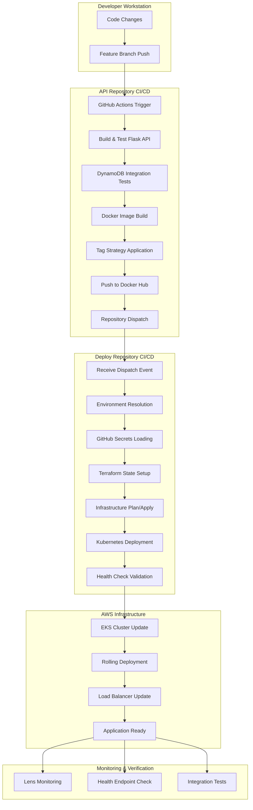

# 🚀 Guest List Management System - DevSecOps Final Project

**Course:** DevSecOps  
**Team Members:** Gili, Sivan, Sahar, Dvir  
**Presenters:** Sivan & Dvir  

A complete end-to-end DevSecOps implementation featuring automated CI/CD pipelines, Infrastructure as Code, and cloud-native deployment on AWS EKS with cross-repository orchestration.

---

## 📋 Project Overview

This project demonstrates advanced DevSecOps practices through a modern guest management system with two interconnected repositories:

- **[Guest-List-API](https://github.com/SivanMon/Guest-List-API)** - Flask REST API with automated testing and Docker containerization
- **[Guest-List-Deploy](https://github.com/SivanMon/Guest-List-Deploy)** - Infrastructure as Code with Terraform, AWS EKS, and Kubernetes

### 🎯 Key Highlights

- **Multi-Environment Strategy:** Individual student environments (gili, sivan, sahar, dvir) + shared dev/staging/main
- **Cross-Repository Orchestration:** GitHub Actions repository dispatch events
- **Smart Docker Tagging:** Branch-based tagging strategy with SHA integration
- **Zero-Downtime Deployments:** Rolling updates with health checks
- **Manual Staging Process:** Quality assurance gate before production
- **Infrastructure as Code:** Complete AWS infrastructure managed through Terraform
- **Container Orchestration:** Kubernetes deployment on AWS EKS

---

## 🏗️ Architecture Overview

### 🚀 DevSecOps Pipeline Flow

```
┌─────────────────────────────────────────────────────────────────────────────────┐
│                         🚀 Guest List DevSecOps Architecture                     │
└─────────────────────────────────────────────────────────────────────────────────┘

🔧 DEVELOPMENT          🏗️ BUILD & DEPLOY       ☁️ INFRASTRUCTURE      📊 MONITORING
┌─────────────────┐     ┌─────────────────┐     ┌─────────────────┐     ┌─────────────────┐
│                 │     │                 │     │                 │     │                 │
│ 📁 API Repo    │────▶│ 🐳 Docker Hub  │────▶│ ☸️  AWS EKS    │────▶│ 👁️  Lens       │
│   Flask API     │     │   Smart Tags    │     │   Kubernetes    │     │   Monitoring    │
│                 │     │                 │     │                 │     │                 │
│ 🌿 Feature     │     │ 🔄 Repo         │     │ 🗄️  DynamoDB   │      │ 💓 Health       │
│   Branches      │────▶│   Dispatch     │────▶│   NoSQL DB      │     │   Probes        │
│                 │     │                 │     │                 │     │                 │
│ ⚙️  GitHub     │     │ 🏗️  Deploy      │     │ 🏗️  Terraform   │     │ ⚖️  Load        │
│   Actions       │     │   Repository    │     │   IaC           │     │   Balancer      │
│                 │     │                 │     │                 │     │                 │
└─────────────────┘     └─────────────────┘     └─────────────────┘     └─────────────────┘
```

### 🏢 Multi-Environment Strategy

| 🎯 Environment | 📝 Purpose | 🚀 Deployment | 🔒 Approval | 🏷️ Docker Tag | 🗄️ Database |
|---|---|---|---|---|---|
| **👤 gili** | Individual development | Manual | None | `gili-feature-{sha7}` | `GuestList-gili` |
| **👤 sivan** | Individual development | Manual | None | `sivan-feature-{sha7}` | `GuestList-sivan` |
| **👤 sahar** | Individual development | Manual | None | `sahar-feature-{sha7}` | `GuestList-sahar` |
| **👤 dvir** | Individual development | Manual | None | `dvir-feature-{sha7}` | `GuestList-dvir` |
| **🧪 dev** | Integration testing | Automatic | None | `dev-{sha7}` | `GuestList-dev` |
| **🎭 staging** | Manual QA validation | Manual | Required | `dev-{sha7}` | `GuestList-staging` |
| **🏭 main** | Production | Automatic on PR | Required | `latest` + `{sha7}` | `GuestList-main` |

### 🔄 CI/CD Pipeline Triggers

| 📤 Trigger Source | 🎯 Event | 🏷️ Docker Tag | 📨 Dispatch Event | 🎯 Target Environment | ⚙️ Action |
|---|---|---|---|---|---|
| Push to `main` | Code merge | `latest` + `{sha7}` | None | - | Build only |
| Push to `dev` | Integration | `dev-{sha7}` | `deploy_plan` | dev | Infrastructure planning |
| PR to `main` | Production | None | `deploy_apply` | main | Production deployment |
| Manual `staging` | QA Testing | `dev-{sha7}` | `deploy_apply` | staging | Staging deployment |
| Feature push | Development | `{student}-feature-{sha7}` | None | individual | Manual deployment |

### 🛠️ Technology Stack

#### 🔧 **Backend & API**
- **🐍 Flask** - Python web framework
- **🐍 Python 3.11** - Programming language  
- **📡 Boto3** - AWS SDK for Python
- **🔢 UUID** - Unique identifier generation

#### ☁️ **Infrastructure & Cloud**
- **☸️ AWS EKS** - Managed Kubernetes service
- **🗄️ DynamoDB** - NoSQL database
- **🌐 AWS VPC** - Virtual Private Cloud
- **🏗️ Terraform v1.9.8** - Infrastructure as Code
- **🐳 Docker** - Containerization platform

#### 🚀 **CI/CD & Automation**
- **⚙️ GitHub Actions** - Pipeline automation
- **🐳 Docker Hub** - Container registry
- **📨 Repository Dispatch** - Cross-repo communication
- **🗄️ S3 + DynamoDB** - State management

#### 📊 **Monitoring & Observability**
- **👁️ Lens for Kubernetes** - Cluster monitoring
- **💓 Health Probes** - Application health
- **☁️ AWS CloudWatch** - Infrastructure monitoring
- **⚖️ Load Balancer** - Traffic management

## 👥 Collaborative Development Workflow

### Team Development Process

Our team implements a structured collaborative workflow that ensures code quality and prevents conflicts:

#### 1. **Feature Development Flow**
```
Individual Work:
gili-feature-authentication ──┐
sivan-feature-validation ──────┤
sahar-feature-frontend ────────┼──► dev (Integration) ──► staging (Manual QA) ──► main (Production)
dvir-feature-deployment ───────┘
```

#### 2. **Branch Protection & Collaboration Rules**
- **Feature Branches:** Each team member works on isolated feature branches
- **Integration Branch:** `dev` serves as integration point for all features
- **Production Branch:** `main` requires pull request with team review
- **Code Reviews:** All PRs require at least one approval before merge
- **CI/CD Gates:** All tests must pass before merge is allowed

#### 3. **Development Cycle**
1. **Individual Development**
   ```bash
   # Each team member creates feature branch
   git checkout -b sivan-feature-user-validation
   git push origin sivan-feature-user-validation
   ```

2. **Integration Testing**
   ```bash
   # Merge feature to dev for integration testing
   git checkout dev
   git merge sivan-feature-user-validation
   git push origin dev
   # Triggers automatic deployment to dev environment
   ```

#### 3. **Development Cycle**
1. **Individual Development**
   ```bash
   # Each team member creates feature branch
   git checkout -b sivan-feature-user-validation
   git push origin sivan-feature-user-validation
   ```

2. **Integration Testing**
   ```bash
   # Merge feature to dev for integration testing
   git checkout dev
   git merge sivan-feature-user-validation
   git push origin dev
   # Triggers automatic deployment to dev environment
   ```

3. **Staging Validation (Manual Process)**
   ```bash
   # When dev version is stable and working well
   # Manual deployment to staging for final QA
   gh workflow run clean-terraform.yml \
     -f action=apply \
     -f environment=staging
   # Team performs manual testing and validation
   # Staging uses same dev image tag for consistency
   ```

4. **Production Release**
   ```bash
   # Create PR from dev to main after staging approval
   # Requires team review and CI/CD success
   # Triggers automatic deployment to production
   ```

#### 4. **Collaborative Benefits**
- **Parallel Development:** Each team member can work independently
- **Safe Integration:** Dev environment tests all features together
- **Staging Validation:** Manual QA process ensures production readiness
- **Quality Gates:** Automated testing prevents broken code from reaching production
- **Shared Responsibility:** All team members can review and approve changes

---

## 🔐 GitHub Environment Secrets Strategy

### Environment-Based Secret Management

We implement a comprehensive secret management strategy using GitHub Environments for security and isolation:

#### **Environment Structure**

| Environment | Purpose | Secrets Required | Auto-Approval |
|---|---|---|---|
| `gili` | Individual development | Personal AWS credentials | ✅ Yes |
| `sivan` | Individual development | Personal AWS credentials | ✅ Yes |
| `sahar` | Individual development | Personal AWS credentials | ✅ Yes |
| `dvir` | Individual development | Personal AWS credentials | ✅ Yes |
| `dev` | Shared development | Shared dev AWS credentials | ✅ Yes |
| `staging` | Pre-production testing | Staging AWS credentials | 🔒 Manual approval |
| `main` | Production | Production AWS credentials | 🔒 Manual approval |

#### **Required Secrets per Environment**

```yaml
# Individual Student Environments (gili, sivan, sahar, dvir)
Environment Secrets:
  AWS_ACCESS_KEY_ID: # Individual AWS access key
  AWS_SECRET_ACCESS_KEY: # Individual AWS secret key
  AWS_REGION: us-east-1
  # Optional: Individual specific configs

# Development Environment
Environment: dev
Secrets:
  AWS_ACCESS_KEY_ID: # Shared dev AWS credentials
  AWS_SECRET_ACCESS_KEY: # Shared dev AWS credentials
  AWS_REGION: us-east-1
  DDB_TABLE_PREFIX: GuestList-dev

# Staging Environment  
Environment: staging
Secrets:
  AWS_ACCESS_KEY_ID: # Staging AWS credentials
  AWS_SECRET_ACCESS_KEY: # Staging AWS credentials
  AWS_REGION: us-east-1
  DDB_TABLE_PREFIX: GuestList-staging

# Production Environment
Environment: main
Secrets:
  AWS_ACCESS_KEY_ID: # Production AWS credentials
  AWS_SECRET_ACCESS_KEY: # Production AWS credentials
  AWS_REGION: us-east-1
  DDB_TABLE_PREFIX: GuestList-main
```

#### **Secret Usage in Workflows**

```yaml
# API Repository Workflow
jobs:
  deploy:
    runs-on: ubuntu-latest
    environment: ${{ github.event.inputs.environment || 'dev' }}
    steps:
      - name: Configure AWS credentials
        env:
          AWS_ACCESS_KEY_ID: ${{ secrets.AWS_ACCESS_KEY_ID }}
          AWS_SECRET_ACCESS_KEY: ${{ secrets.AWS_SECRET_ACCESS_KEY }}
          AWS_REGION: ${{ secrets.AWS_REGION }}

# Deploy Repository Workflow
jobs:
  terraform:
    runs-on: ubuntu-latest
    environment: ${{ github.event.client_payload.environment || 'dev' }}
    steps:
      - name: Terraform Apply
        env:
          AWS_ACCESS_KEY_ID: ${{ secrets.AWS_ACCESS_KEY_ID }}
          AWS_SECRET_ACCESS_KEY: ${{ secrets.AWS_SECRET_ACCESS_KEY }}
          TF_VAR_environment: ${{ github.event.client_payload.environment }}
```

#### **Security Benefits**
- **Environment Isolation:** Each environment has separate credentials
- **Least Privilege:** Each environment only has access to its resources
- **Approval Gates:** Production changes require manual approval
- **Audit Trail:** All secret usage is logged and tracked
- **Individual Accountability:** Each student has separate credentials for development

#### **Environment Configuration Steps**

1. **Create GitHub Environments**
   ```bash
   # In both repositories: Guest-List-API and Guest-List-Deploy
   # Navigate to Settings → Environments → New Environment
   # Create: gili, sivan, sahar, dvir, dev, staging, main
   ```

2. **Configure Protection Rules**
   ```yaml
   # Individual environments (gili, sivan, sahar, dvir, dev)
   Protection Rules: None (auto-approval)
   
   # Staging environment
   Protection Rules:
     - Required reviewers: At least 1 team member
     - Deployment branches: Only dev branch
   
   # Production environment (main)  
   Protection Rules:
     - Required reviewers: At least 2 team members
     - Deployment branches: Only main branch
     - Wait timer: 5 minutes before deployment
   ```

3. **Add Secrets to Each Environment**
   ```bash
   # For each environment, add the required secrets:
   # Settings → Environments → [Environment Name] → Add Secret
   ```

---

### **Backend & API**
- **Flask** - Python web framework
- **Python 3.11** - Programming language
- **Boto3** - AWS SDK for Python
- **UUID** - Unique identifier generation
- **Israeli Phone Validation** - Custom validation logic

### **Infrastructure & Cloud**
- **AWS EKS** - Managed Kubernetes service
- **AWS DynamoDB** - NoSQL database
- **AWS VPC** - Virtual Private Cloud networking
- **Terraform v1.9.8** - Infrastructure as Code
- **Docker** - Containerization platform
- **Kubernetes** - Container orchestration

### **CI/CD & Automation**
- **GitHub Actions** - Pipeline automation
- **Docker Hub** - Container registry
- **Repository Dispatch** - Cross-repository communication
- **S3 + DynamoDB** - Terraform remote state management

### **Monitoring & Observability**
- **Lens for Kubernetes** - Cluster monitoring and management
- **Kubernetes Health Probes** - Application health monitoring
- **AWS CloudWatch** - Infrastructure monitoring

---

## 🔄 Development Workflow

### Branch Strategy & Environment Mapping

```
┌─────────────────┐    ┌─────────────────┐    ┌─────────────────┐
│ Feature Branches│    │ Integration     │    │ Production      │
│                 │    │ Environment     │    │ Environment     │
│ ┌─────────────┐ │    │ ┌─────────────┐ │    │ ┌─────────────┐ │
│ │gili-feature │ │    │ │    dev      │ │    │ │    main     │ │
│ │sivan-feature│ │──▶ │ │             │ │──▶ │ │             │ │
│ │sahar-feature│ │    │ │ Shared      │ │    │ │ Production  │ │
│ │dvir-feature │ │    │ │ Testing     │ │    │ │ Stable      │ │
│ └─────────────┘ │    │ │ Integration │ │    │ │ Release     │ │
└─────────────────┘    │ └─────────────┘ │    │ └─────────────┘ │
                       └─────────────────┘    └─────────────────┘
```

### 🏷️ Docker Tagging Strategy

| Branch Pattern | Docker Tag | Environment | Auto-Deploy |
|---|---|---|---|
| `main` | `latest` + `{sha7}` | Production | ✅ PR merge |
| `dev` | `dev-{sha7}` | Development | ✅ Direct push |
| `{student}-feature-*` | `{student}-feature-{sha7}` | Individual | 🔧 Manual |

**Examples:**
- `main` → `sivanmonshi/guestlistapi:latest`, `sivanmonshi/guestlistapi:a1b2c3d`
- `dev` → `sivanmonshi/guestlistapi:dev-a1b2c3d`
- `sivan-auth-feature` → `sivanmonshi/guestlistapi:sivan-feature-a1b2c3d`

**Key Benefits:**
- **Traceability:** Every image can be traced back to specific commit
- **Environment Safety:** Clear separation between dev/prod images
- **Student Isolation:** Individual feature branches don't conflict
- **Rollback Capability:** SHA tags enable precise rollback to any commit

---

## 🚀 Complete CI/CD Pipeline Flow

### Full Development-to-Production Pipeline

Our CI/CD pipeline implements a complete DevSecOps workflow from individual development to production deployment:



### Detailed Pipeline Stages

#### **Stage 1: Code Development & Push**
```bash
# Developer workflow
git checkout -b sivan-feature-auth-enhancement
# Make changes to Flask API
git add .
git commit -m "Add enhanced authentication with validation"
git push origin sivan-feature-auth-enhancement

# For dev integration
git checkout dev
git merge sivan-feature-auth-enhancement
git push origin dev
```

**Triggers:**
- Individual feature push → Feature branch image build
- Dev branch push → Development environment deployment
- Main branch PR → Production environment deployment

#### **Stage 2: API Repository CI/CD (Guest-List-API)**

**Build & Test Phase:**
```yaml
name: API CI/CD Pipeline
on:
  push:
    branches: [ main, dev, "*-feature-*" ]
  pull_request:
    branches: [ main ]
  workflow_dispatch:
    inputs:
      environment:
        type: choice
        options: [dev, staging, main, gili, sivan, sahar, dvir]

jobs:
  test:
    runs-on: ubuntu-latest
    steps:
      - name: Checkout code
        uses: actions/checkout@v4
        
      - name: Setup Python
        uses: actions/setup-python@v4
        with:
          python-version: '3.11'
          
      - name: Install dependencies
        run: pip install -r requirements.txt
        
      - name: Start DynamoDB Local
        run: |
          docker run -d -p 8000:8000 amazon/dynamodb-local:latest
          
      - name: Setup test environment
        env:
          DDB_ENDPOINT_URL: http://localhost:8000
          DDB_TABLE: guests-test
          AWS_REGION: us-east-1
          AWS_ACCESS_KEY_ID: test
          AWS_SECRET_ACCESS_KEY: test
        run: |
          # Create test table
          aws dynamodb create-table \
            --table-name guests-test \
            --attribute-definitions AttributeName=seq_num,AttributeType=S \
            --key-schema AttributeName=seq_num,KeyType=HASH \
            --billing-mode PAY_PER_REQUEST \
            --endpoint-url http://localhost:8000
          
      - name: Run API tests
        run: |
          # Start API in background
          python guestlist-server.py &
          sleep 10
          
          # Test all endpoints
          curl -f http://localhost:1111/health
          curl -f http://localhost:1111/guests
          # Add comprehensive API testing
```

**Docker Build & Push Phase:**
```yaml
  build-and-push:
    needs: test
    runs-on: ubuntu-latest
    environment: ${{ github.event.inputs.environment || (github.ref == 'refs/heads/main' && 'main') || (github.ref == 'refs/heads/dev' && 'dev') || 'dev' }}
    steps:
      - name: Set up Docker Buildx
        uses: docker/setup-buildx-action@v3
        
      - name: Login to Docker Hub
        uses: docker/login-action@v3
        with:
          username: sivanmonshi
          password: ${{ secrets.DOCKER_PASSWORD }}
          
      - name: Extract metadata
        id: meta
        run: |
          BRANCH_NAME=${GITHUB_REF#refs/heads/}
          SHORT_SHA=${GITHUB_SHA::7}
          
          if [[ "$BRANCH_NAME" == "main" ]]; then
            echo "tags=sivanmonshi/guestlistapi:latest,sivanmonshi/guestlistapi:$SHORT_SHA" >> $GITHUB_OUTPUT
          elif [[ "$BRANCH_NAME" == "dev" ]]; then
            echo "tags=sivanmonshi/guestlistapi:dev-$SHORT_SHA" >> $GITHUB_OUTPUT
          elif [[ "$BRANCH_NAME" =~ ^(gili|sivan|sahar|dvir)-feature- ]]; then
            STUDENT=$(echo $BRANCH_NAME | cut -d'-' -f1)
            echo "tags=sivanmonshi/guestlistapi:$STUDENT-feature-$SHORT_SHA" >> $GITHUB_OUTPUT
          fi
          
      - name: Build and push
        uses: docker/build-push-action@v5
        with:
          push: true
          tags: ${{ steps.meta.outputs.tags }}
```

#### **Stage 3: Cross-Repository Communication**

**Repository Dispatch Events:**
```yaml
  dispatch-deploy:
    needs: build-and-push
    runs-on: ubuntu-latest
    if: github.ref == 'refs/heads/dev' || github.ref == 'refs/heads/main' || github.event_name == 'workflow_dispatch'
    steps:
      - name: Determine deployment action
        id: deploy-action
        run: |
          if [[ "${{ github.event_name }}" == "pull_request" && "${{ github.base_ref }}" == "main" ]]; then
            echo "event_type=deploy_apply" >> $GITHUB_OUTPUT
            echo "environment=main" >> $GITHUB_OUTPUT
          elif [[ "${{ github.ref }}" == "refs/heads/dev" ]]; then
            echo "event_type=deploy_plan" >> $GITHUB_OUTPUT
            echo "environment=dev" >> $GITHUB_OUTPUT
          elif [[ "${{ github.event.inputs.environment }}" != "" ]]; then
            if [[ "${{ github.event.inputs.environment }}" == "dev" ]]; then
              echo "event_type=deploy_plan" >> $GITHUB_OUTPUT
            else
              echo "event_type=deploy_apply" >> $GITHUB_OUTPUT
            fi
            echo "environment=${{ github.event.inputs.environment }}" >> $GITHUB_OUTPUT
          fi
          
      - name: Repository Dispatch
        uses: peter-evans/repository-dispatch@v3
        with:
          token: ${{ secrets.REPO_DISPATCH_TOKEN }}
          repository: SivanMon/Guest-List-Deploy
          event-type: ${{ steps.deploy-action.outputs.event_type }}
          client-payload: |
            {
              "environment": "${{ steps.deploy-action.outputs.environment }}",
              "image_tag": "${{ needs.build-and-push.outputs.image_tag }}",
              "triggered_by": "${{ github.actor }}",
              "source_repo": "Guest-List-API",
              "commit_sha": "${{ github.sha }}"
            }
```

#### **Stage 4: Infrastructure Deployment (Guest-List-Deploy)**

**Environment Resolution & Setup:**
```yaml
name: Clean Terraform Deployment
on:
  repository_dispatch:
    types: [deploy_plan, deploy_apply]
  workflow_dispatch:
    inputs:
      action:
        type: choice
        options: [plan, apply, destroy]
      environment:
        type: choice  
        options: [gili, sivan, sahar, dvir, dev, staging, main]

jobs:
  deploy:
    runs-on: ubuntu-latest
    environment: ${{ github.event.client_payload.environment || github.event.inputs.environment || 'dev' }}
    steps:
      - name: Resolve deployment parameters
        id: params
        run: |
          if [[ "${{ github.event_name }}" == "repository_dispatch" ]]; then
            echo "environment=${{ github.event.client_payload.environment }}" >> $GITHUB_OUTPUT
            echo "action=${{ github.event.action }}" >> $GITHUB_OUTPUT
            echo "image_tag=${{ github.event.client_payload.image_tag }}" >> $GITHUB_OUTPUT
          else
            echo "environment=${{ github.event.inputs.environment }}" >> $GITHUB_OUTPUT
            echo "action=${{ github.event.inputs.action }}" >> $GITHUB_OUTPUT
          fi
          
      - name: Configure AWS credentials
        uses: aws-actions/configure-aws-credentials@v4
        with:
          aws-access-key-id: ${{ secrets.AWS_ACCESS_KEY_ID }}
          aws-secret-access-key: ${{ secrets.AWS_SECRET_ACCESS_KEY }}
          aws-region: ${{ secrets.AWS_REGION || 'us-east-1' }}
          
      - name: Setup Terraform backend
        run: |
          # Create S3 bucket for state if needed
          aws s3api create-bucket \
            --bucket guestlist-tfstate-sivanmon-guest-list-deploy \
            --region us-east-1 \
            --create-bucket-configuration LocationConstraint=us-east-1 \
            || true
            
          # Create DynamoDB table for state locking
          aws dynamodb create-table \
            --table-name terraform-locks \
            --attribute-definitions AttributeName=LockID,AttributeType=S \
            --key-schema AttributeName=LockID,KeyType=HASH \
            --billing-mode PAY_PER_REQUEST \
            || true
```

**Terraform Execution:**
```yaml
      - name: Terraform Init
        run: |
          terraform init \
            -backend-config="bucket=guestlist-tfstate-sivanmon-guest-list-deploy" \
            -backend-config="key=envs/${{ steps.params.outputs.environment }}/terraform.tfstate" \
            -backend-config="region=us-east-1" \
            -backend-config="dynamodb_table=terraform-locks" \
            -backend-config="encrypt=true"
            
      - name: Resolve Docker image tag
        id: image
        run: |
          ENV="${{ steps.params.outputs.environment }}"
          if [[ "${{ steps.params.outputs.image_tag }}" != "" ]]; then
            echo "tag=${{ steps.params.outputs.image_tag }}" >> $GITHUB_OUTPUT
          else
            # Query Docker Hub API for latest tag
            if [[ "$ENV" == "main" ]]; then
              TAG="latest"
            elif [[ "$ENV" == "dev" ]]; then
              # Get latest dev tag with SHA
              TAG=$(curl -s "https://hub.docker.com/v2/repositories/sivanmonshi/guestlistapi/tags/?page_size=100" | \
                jq -r '.results[] | select(.name | startswith("dev-")) | .name' | head -1)
            else
              # Individual environment - get latest student tag
              TAG=$(curl -s "https://hub.docker.com/v2/repositories/sivanmonshi/guestlistapi/tags/?page_size=100" | \
                jq -r ".results[] | select(.name | startswith(\"$ENV-feature-\")) | .name" | head -1)
            fi
            echo "tag=$TAG" >> $GITHUB_OUTPUT
          fi
          
      - name: Terraform Plan/Apply
        run: |
          terraform ${{ steps.params.outputs.action }} \
            -var="environment=${{ steps.params.outputs.environment }}" \
            -var="image_tag=${{ steps.image.outputs.tag }}" \
            -var="aws_region=us-east-1" \
            -auto-approve
```

#### **Stage 5: Kubernetes Deployment & Verification**

**Application Deployment:**
```yaml
      - name: Verify Kubernetes deployment
        run: |
          # Update kubeconfig
          aws eks update-kubeconfig --name guestlist-cluster --region us-east-1
          
          # Wait for rollout completion
          kubectl rollout status deployment/guestlist-deployment -n guestlist --timeout=300s
          
          # Verify pods are running
          kubectl get pods -n guestlist -l app=guestlist-api
          
          # Check service endpoints
          kubectl get svc guestlist-service -n guestlist
          
      - name: Health check verification
        run: |
          # Get load balancer endpoint
          LB_ENDPOINT=$(kubectl get svc guestlist-service -n guestlist -o jsonpath='{.status.loadBalancer.ingress[0].hostname}')
          
          # Wait for load balancer to be ready
          for i in {1..30}; do
            if curl -f "http://$LB_ENDPOINT:9999/health" > /dev/null 2>&1; then
              echo "Application is healthy!"
              break
            fi
            echo "Waiting for application... ($i/30)"
            sleep 10
          done
          
          # Test API endpoints
          curl -s "http://$LB_ENDPOINT:9999/api" | jq .
          echo "Deployment completed successfully!"
```

### Pipeline Integration Points

**Event-Driven Architecture:**
1. **Code Push** → API CI/CD → Docker Build → Repository Dispatch
2. **Repository Dispatch** → Deploy CI/CD → Terraform → Kubernetes  
3. **Kubernetes Deployment** → Health Checks → Lens Monitoring

**Environment-Specific Behavior:**
- **Individual environments** (gili/sivan/sahar/dvir): Manual deployment only
- **Dev environment**: Automatic planning on push, used for integration testing
- **Staging environment**: Manual deployment when dev is stable - uses dev image tag for consistency testing
- **Main environment**: Automatic deployment on PR merge with approval after staging validation

**Rollback Strategy:**
```bash
# Emergency rollback using specific image tag
gh workflow run clean-terraform.yml \
  -f action=apply \
  -f environment=main \
  -f image_tag=sivanmonshi/guestlistapi:abc1234  # Previous working SHA
```

---

## 🏛️ Infrastructure Architecture

### AWS Cloud Environment

```
┌─────────────────────────────────────────────────────────────────┐
│                          AWS Cloud Infrastructure                │
│                                                                 │
│  ┌─────────────────┐           ┌─────────────────────────┐      │
│  │ VPC Network     │           │ DynamoDB Tables         │      │
│  │                 │           │                         │      │
│  │ ┌─────────────┐ │           │ ┌─────────────────────┐ │      │
│  │ │Public       │ │           │ │ GuestList-gili      │ │      │
│  │ │Subnets      │ │     ┌────▶│ │ GuestList-sivan     │ │      │
│  │ │(2x AZs)     │ │     │     │ │ GuestList-sahar     │ │      │
│  │ └─────────────┘ │     │     │ │ GuestList-dvir      │ │      │
│  │                 │     │     │ │ GuestList-dev       │ │      │
│  │ ┌─────────────┐ │     │     │ │ GuestList-staging   │ │      │
│  │ │Private      │ │     │     │ │ GuestList-main      │ │      │
│  │ │Subnets      │ │     │     └─────────────────────────┘      │
│  │ │(2x AZs)     │ │     │                                      │
│  │ └─────────────┘ │     │                                      │
│  │                 │     │     ┌─────────────────────────┐      │
│  │ ┌─────────────┐ │     │     │ EKS Cluster             │      │
│  │ │EKS Cluster  │ │─────┘     │                         │      │
│  │ │             │ │           │ ┌─────────────────────┐ │      │
│  │ │Worker Nodes │ │           │ │ Managed Node Groups │ │      │
│  │ │(t3.small)   │ │           │ │ Min: 1, Max: 3      │ │      │
│  │ │Auto Scaling │ │           │ │ Instance: t3.small  │ │      │
│  │ └─────────────┘ │           │ └─────────────────────┘ │      │
│  └─────────────────┘           └─────────────────────────┘      │
│                                                                 │
│  ┌─────────────────────────────────────────────────────────┐   │
│  │                Load Balancer                            │   │
│  │                                                         │   │
│  │  ┌─────────┐  ┌─────────┐  ┌─────────┐  ┌─────────┐   │   │
│  │  │  Pod 1  │  │  Pod 2  │  │  Pod 3  │  │   ...   │   │   │
│  │  └─────────┘  └─────────┘  └─────────┘  └─────────┘   │   │
│  │                Service: guestlist-service              │   │
│  │                Port: 9999 → 1111                       │   │
│  └─────────────────────────────────────────────────────────┘   │
└─────────────────────────────────────────────────────────────────┘
```

### Kubernetes Configuration

```yaml
# Namespace
apiVersion: v1
kind: Namespace
metadata:
  name: guestlist

# Deployment
apiVersion: apps/v1
kind: Deployment
metadata:
  name: guestlist-deployment
  namespace: guestlist
spec:
  replicas: 3
  selector:
    matchLabels:
      app: guestlist-api
  template:
    spec:
      containers:
      - name: guestlist-container
        image: sivanmonshi/guestlistapi:${IMAGE_TAG}
        ports:
        - containerPort: 1111
        env:
        - name: DDB_TABLE
          valueFrom:
            secretKeyRef:
              name: guestlist-aws
              key: DDB_TABLE

# Service with Load Balancer
apiVersion: v1
kind: Service
metadata:
  name: guestlist-service
  namespace: guestlist
spec:
  type: LoadBalancer
  selector:
    app: guestlist-api
  ports:
  - port: 9999
    targetPort: 1111

# Horizontal Pod Autoscaler
apiVersion: autoscaling/v2
kind: HorizontalPodAutoscaler
metadata:
  name: guestlist-hpa
spec:
  scaleTargetRef:
    apiVersion: apps/v1
    kind: Deployment
    name: guestlist-deployment
  minReplicas: 1
  maxReplicas: 5
  metrics:
  - type: Resource
    resource:
      name: cpu
      target:
        type: Utilization
        averageUtilization: 70
```

---

## 🎬 Live Demo Workflow

### Prerequisites for Demo

1. **Lens for Kubernetes** installed and connected to EKS cluster
2. **Access to both GitHub repositories**
3. **Docker Hub repository** (`sivanmonshi/guestlistapi`)
4. **AWS EKS cluster** running in `us-east-1`

### Demo Scenario: Complete Development Cycle

#### Step 1: Show Current State
```bash
# Display current deployments in Lens
kubectl get deployments -n guestlist
kubectl get services -n guestlist
kubectl get pods -n guestlist
```

#### Step 2: Make Application Change
```bash
# In Guest-List-API repository
git checkout dev
# Make a visible change (e.g., modify health endpoint response)
vim guestlist-server.py  # Add timestamp to health response
git add .
git commit -m "Add timestamp to health endpoint for demo"
git push origin dev
```

#### Step 3: Monitor CI/CD Pipeline
1. **GitHub Actions** - Show workflow running in Guest-List-API
2. **Docker Hub** - Show new `dev` tag being created
3. **Repository Dispatch** - Show deployment workflow triggered in Guest-List-Deploy
4. **Terraform** - Show infrastructure planning in deploy workflow

#### Step 4: Lens Monitoring
1. **Show Rolling Update** in Lens:
   - Navigate to Workloads → Deployments
   - Watch `guestlist-deployment` rolling update
   - Monitor pod replacement process
2. **Service Discovery**:
   - Show Load Balancer service endpoint
   - Monitor service health during deployment
3. **Real-time Logs**:
   - Stream pod logs to show application startup
   - Verify new health endpoint response

#### Step 5: Verify Dev Deployment
```bash
# Get load balancer URL
kubectl get svc guestlist-service -n guestlist

# Test updated endpoint
curl http://<LOAD_BALANCER_URL>:9999/health

# Verify new response includes timestamp
```

#### Step 6: Staging Validation (Manual Process)
```bash
# When dev version is stable and working properly
# Manual deployment to staging for final QA
gh workflow run clean-terraform.yml \
  -f action=apply \
  -f environment=staging

# Team performs manual testing in staging environment
# Verify staging uses same dev image tag for consistency
```

**Staging Demo Points:**
1. **Manual Trigger** - Show workflow_dispatch manual execution
2. **Environment Secrets** - Show staging environment protection rules
3. **Same Image Tag** - Verify staging uses dev-{sha7} tag for consistency
4. **Manual QA** - Demonstrate team validation process
5. **Approval Gate** - Show manual approval requirement

#### Step 7: Production Deployment
```bash
# Create PR from dev to main AFTER staging approval
git checkout main
git pull origin main
# Create PR: dev → main

# Show production deployment trigger
# Monitor terraform apply in deploy repository
# Verify production deployment in Lens
```

### 📸 Demo Screenshots Checklist

- [ ] **GitHub Actions** workflow execution
- [ ] **Docker Hub** automated image building
- [ ] **Repository Dispatch** cross-repo trigger
- [ ] **Lens Dashboard** showing cluster overview
- [ ] **Rolling Update** in progress
- [ ] **Pod Logs** streaming
- [ ] **Load Balancer** configuration
- [ ] **Health Endpoint** response change
- [ ] **Staging Manual Trigger** workflow_dispatch
- [ ] **Environment Protection Rules** staging approval
- [ ] **Staging QA Process** team validation
- [ ] **Terraform Apply** infrastructure changes

---

## 🔍 API Endpoints

### Core Functionality
- `GET /guests` - Retrieve all guests
- `POST /guests` - Add new guest with validation
- `GET /guests/{id}` - Get specific guest by sequence number
- `DELETE /guests/{id}` - Remove guest by sequence number

### Health & Monitoring
- `GET /health` - Application health check
- `GET /healthz` - Kubernetes readiness probe
- `GET /readyz` - Kubernetes liveness probe
- `GET /api` - API information and configuration
- `GET /` - Frontend web interface

### Sample API Usage
```bash
# Add a guest
curl -X POST http://localhost:9999/guests \
  -H "Content-Type: application/json" \
  -d '{
    "id": "12345",
    "firstname": "John",
    "surname": "Doe",
    "quantity": "2",
    "phone": "0541234567",
    "email": "john.doe@example.com"
  }'

# Get all guests
curl http://localhost:9999/guests

# Health check
curl http://localhost:9999/health
```

---

## 🛠️ Local Development Setup

### Quick Start
```bash
# Clone both repositories
git clone https://github.com/SivanMon/Guest-List-API.git
git clone https://github.com/SivanMon/Guest-List-Deploy.git

# API Development
cd Guest-List-API
python -m venv venv
source venv/bin/activate
pip install -r requirements.txt

# Start local DynamoDB
docker run -d -p 8000:8000 amazon/dynamodb-local:latest

# Set environment variables
export DDB_ENDPOINT_URL=http://localhost:8000
export DDB_TABLE=guests-local
export AWS_REGION=us-east-1
export AWS_ACCESS_KEY_ID=localtest
export AWS_SECRET_ACCESS_KEY=localtest

# Create local table
aws dynamodb create-table \
  --table-name guests-local \
  --attribute-definitions AttributeName=seq_num,AttributeType=S \
  --key-schema AttributeName=seq_num,KeyType=HASH \
  --billing-mode PAY_PER_REQUEST \
  --endpoint-url http://localhost:8000

# Run the application
python guestlist-server.py
```

### Infrastructure Testing
```bash
# Deploy Repository
cd Guest-List-Deploy
terraform init
terraform plan -var="environment=dev"
terraform apply -var="environment=dev"
```

---

## 🔒 Security & Best Practices

### Infrastructure Security
- **Minimal IAM Permissions** - Least privilege principle
- **VPC Isolation** - Private subnets for worker nodes
- **Security Groups** - Controlled ingress/egress
- **Secrets Management** - Kubernetes secrets for AWS credentials
- **Encrypted State** - S3 bucket encryption with versioning

### Application Security
- **Input Validation** - Israeli phone number validation
- **Health Checks** - Readiness and liveness probes
- **Container Security** - Non-root user in Docker
- **Network Policies** - Kubernetes network segmentation

### CI/CD Security
- **GitHub Secrets** - Encrypted environment variables
- **Branch Protection** - Required PR reviews
- **Container Scanning** - Automated vulnerability assessment
- **State Locking** - DynamoDB prevents concurrent modifications

---

## 📊 Monitoring & Observability

### Kubernetes Monitoring
- **Lens Dashboard** - Real-time cluster monitoring
- **Pod Logs** - Centralized logging via kubectl
- **Resource Metrics** - CPU/Memory utilization
- **Health Probes** - Application health monitoring

### Application Monitoring
```bash
# Monitor deployments
kubectl get deployments -n guestlist -w

# Stream logs
kubectl logs -f deployment/guestlist-deployment -n guestlist

# Port forwarding for local testing
kubectl port-forward svc/guestlist-service 8080:9999 -n guestlist
```

### Infrastructure Monitoring
- **AWS CloudWatch** - Infrastructure metrics
- **EKS Control Plane Logs** - API server auditing
- **Load Balancer Health** - Target group monitoring

---

## 💰 Cost Optimization

### Monthly Cost Estimate
- **EKS Control Plane**: ~$72.00
- **Worker Nodes** (t3.small × 2): ~$30.40
- **NAT Gateway**: ~$32.40
- **Load Balancer**: ~$16.20
- **DynamoDB**: Pay-per-request
- **Total**: ~$151.00/month

### Cost Optimization Strategies
- **Auto Scaling** - Dynamic capacity based on demand
- **t3.small instances** - Cost-effective compute
- **Pay-per-request DynamoDB** - Usage-based billing
- **Single NAT Gateway** - Shared across availability zones
- **Environment cleanup** - Automated destroy workflows

---

## 🚨 Troubleshooting

### Common Issues

#### Terraform State Lock
```bash
# Check lock status
aws dynamodb scan --table-name terraform-locks

# Force unlock (use carefully)
terraform force-unlock LOCK_ID
```

#### EKS Access Issues
```bash
# Update kubeconfig
aws eks update-kubeconfig --region us-east-1 --name guestlist-cluster

# Verify cluster access
kubectl get nodes
```

#### Application Debugging
```bash
# Check pod status
kubectl get pods -n guestlist
kubectl describe pod <pod-name> -n guestlist

# View logs
kubectl logs -f <pod-name> -n guestlist

# Test connectivity
kubectl exec -it <pod-name> -n guestlist -- curl localhost:1111/health
```

---

## 📚 Repository Links

- **API Repository**: [Guest-List-API](https://github.com/SivanMon/Guest-List-API)
- **Deploy Repository**: [Guest-List-Deploy](https://github.com/SivanMon/Guest-List-Deploy)
- **Docker Hub**: [sivanmonshi/guestlistapi](https://hub.docker.com/r/sivanmonshi/guestlistapi)

---

## 🔮 Future Enhancements

- **Service Mesh** - Istio for advanced traffic management
- **GitOps** - ArgoCD for Kubernetes deployments
- **Multi-Region** - Geographic distribution and disaster recovery
- **Advanced Monitoring** - Prometheus/Grafana stack
- **Security Scanning** - Automated container and infrastructure scanning
- **Database Migration** - Blue-green deployment strategies

---

*This project demonstrates comprehensive DevSecOps practices with emphasis on automation, infrastructure as code, and modern cloud-native deployment strategies. The workflow showcases real-world enterprise development practices with proper separation of concerns, security best practices, and comprehensive monitoring.*
