# 🎉 Guest List DevSecOps Project

**DevSecOps Final Project - Complete Cloud-Native Solution**

**Course:** DevSecOps  
**Team Members:** 🧑‍💻 Gili, Sivan, Sahar, Dvir  
**Project Presenters:** 👥 Sivan & Dvir  
**Academic Year:** 2024-2025

---

## 📋 Project Overview

This comprehensive DevSecOps project demonstrates modern cloud-native application development, deployment, and operations practices. We've built a complete guest management system that showcases end-to-end automation, infrastructure as code, container orchestration, and multi-environment deployment strategies.

### 🎯 Project Goals

- **DevSecOps Practices:** Complete CI/CD pipeline with security integration
- **Cloud-Native Architecture:** Scalable, resilient, and maintainable system design  
- **Infrastructure as Code:** Automated infrastructure provisioning and management
- **Multi-Environment Strategy:** Individual development and shared production environments
- **Team Collaboration:** Git workflow supporting parallel development and integration

### 🏆 Key Achievements

✅ **Complete CI/CD Automation** - From code commit to production deployment  
✅ **Multi-Repository Architecture** - Separation of concerns between API and infrastructure  
✅ **Cross-Repository Integration** - Automated triggers and deployment coordination  
✅ **Multi-Environment Support** - 6 environments supporting individual and team development  
✅ **Container Orchestration** - Kubernetes deployment on AWS EKS  
✅ **Infrastructure as Code** - Complete AWS infrastructure managed through Terraform  
✅ **Security Best Practices** - IAM roles, encryption, network isolation  
✅ **Cost Optimization** - Resource-efficient architecture for educational use  

---

## 🏗️ Architecture Overview

```
┌─────────────────────────────────────────────────────────────────────────────────┐
│                           🌟 Complete DevSecOps Architecture                    │
├─────────────────────────────────────────────────────────────────────────────────┤
│                                                                                 │
│  ┌───────────────────┐    ┌──────────────────┐    ┌─────────────────────────┐  │
│  │   Development     │    │    CI/CD         │    │   AWS Cloud             │  │
│  │   Workflow        │    │    Pipeline      │    │   Infrastructure        │  │
│  │                   │    │                  │    │                         │  │
│  │ Feature Branches  │────▶ Build & Test    │────▶ EKS Cluster             │  │
│  │ ├─ gili-feature   │    │ ├─ API Testing   │    │ ├─ Kubernetes Pods      │  │
│  │ ├─ sivan-feature  │    │ ├─ Image Build   │    │ ├─ Load Balancer        │  │
│  │ ├─ sahar-feature  │    │ ├─ Security Scan │    │ ├─ Auto Scaling         │  │
│  │ └─ dvir-feature   │    │ └─ Deploy Trigger│    │ └─ Multi-AZ Deployment  │  │
│  │                   │    │                  │    │                         │  │
│  │ Integration: dev  │────▶ Cross-repo      │────▶ DynamoDB Tables         │  │
│  │ Production: main  │    │ Communication    │    │ ├─ Per-environment      │  │
│  └───────────────────┘    └──────────────────┘    │ ├─ Pay-per-request      │  │
│                                                    │ └─ Encryption at rest   │  │
│                                                    └─────────────────────────┘  │
└─────────────────────────────────────────────────────────────────────────────────┘
```

### 🌈 Multi-Environment Strategy

```
Individual Development    Shared Integration      Production Pipeline
┌─────────────────────┐  ┌─────────────────────┐  ┌─────────────────────┐
│ 🟢 gili Environment │  │ 🔧 dev Environment  │  │ 🎭 staging Environment│
│ 🔵 sivan Environment│──▶ Team Integration   │──▶ Pre-production    │──┐
│ 🟡 sahar Environment│  │ Continuous Testing  │  │ Manual Validation   │  │
│ 🟣 dvir Environment │  │ Feature Validation  │  │ Quality Assurance   │  │
└─────────────────────┘  └─────────────────────┘  └─────────────────────┘  │
                                                                            │
                                                   ┌─────────────────────┐  │
                                                   │ 🏭 main Environment │◀─┘
                                                   │ Production Stable   │
                                                   │ High Availability   │
                                                   │ Performance Optimized│
                                                   └─────────────────────┘
```

---

## 📁 Repository Structure

Our project follows a **two-repository architecture** for optimal separation of concerns:

### 🔥 [Guest-List-API](https://github.com/SivanMon/Guest-List-API) 
**Application Repository**
```
Guest-List-API/
├── 🐍 guestlist-server.py     # Flask REST API application
├── 🌐 index.html              # Web interface
├── 🐳 Dockerfile             # Container configuration
├── 📋 requirements.txt        # Python dependencies
├── ⚙️ .github/workflows/      # CI/CD pipeline
│   └── api-workflow.yml
└── 📚 README.md              # API documentation
```

**Key Features:**
- **Flask REST API** with comprehensive CRUD operations
- **DynamoDB integration** for scalable data storage
- **Web interface** for guest management
- **Docker containerization** with health checks
- **Automated testing** with local DynamoDB
- **Multi-environment image tagging**

### 🎯 [Guest-List-Deploy](https://github.com/SivanMon/Guest-List-Deploy)
**Infrastructure Repository**
```
Guest-List-Deploy/
├── 🏗️ main.tf               # VPC and networking infrastructure
├── ☸️ eks.tf                # EKS cluster configuration
├── 📊 dynamodb.tf           # Database resources
├── 🎛️ kubernetes.tf         # Kubernetes deployments
├── 🔧 variables.tf          # Configuration variables
├── 📤 outputs.tf            # Infrastructure outputs
├── ⚙️ .github/workflows/    # Deployment pipeline
│   └── clean-terraform.yml
└── 📚 README.md            # Infrastructure documentation
```

**Key Features:**
- **Complete AWS infrastructure** as code
- **EKS cluster management** with worker nodes
- **Multi-environment DynamoDB** tables
- **Kubernetes deployments** and services
- **Cross-repository automation** via webhooks
- **State management** with S3 and DynamoDB

---

## 🛠️ Technology Stack

### **Frontend & API**
- **Flask** - Lightweight Python web framework
- **Python 3.11** - Modern Python runtime
- **HTML5/CSS3/JavaScript** - Interactive web interface
- **RESTful API** - Standard HTTP/JSON communication

### **Database & Storage**
- **AWS DynamoDB** - Serverless NoSQL database
- **Pay-per-request billing** - Cost-optimized for learning
- **Encryption at rest** - Security best practices
- **Multi-table strategy** - Environment isolation

### **Container & Orchestration**
- **Docker** - Application containerization
- **Kubernetes** - Container orchestration
- **AWS EKS** - Managed Kubernetes service
- **Horizontal Pod Autoscaler** - Dynamic scaling

### **Infrastructure & Cloud**
- **AWS Cloud** - Complete cloud infrastructure
- **Terraform** - Infrastructure as Code
- **VPC Networking** - Secure network architecture
- **Application Load Balancer** - High availability

### **CI/CD & Automation**
- **GitHub Actions** - Pipeline automation
- **Cross-repository triggers** - Coordinated deployments
- **Docker Hub** - Container registry
- **Automated testing** - Quality assurance

---

## 🚀 Getting Started

### **Quick Start Guide**

1. **Explore the Application:**
   ```bash
   # Visit our repositories
   https://github.com/SivanMon/Guest-List-API
   https://github.com/SivanMon/Guest-List-Deploy
   ```

2. **Understand the Workflow:**
   - Review the [API README](https://github.com/SivanMon/Guest-List-API#readme) for application details
   - Check the [Deploy README](https://github.com/SivanMon/Guest-List-Deploy#readme) for infrastructure
   - See the [Architecture Diagrams](#architecture-diagrams) for visual understanding

3. **Local Development:**
   ```bash
   # Clone the API repository
   git clone https://github.com/SivanMon/Guest-List-API.git
   cd Guest-List-API
   
   # Set up local environment
   python -m venv venv
   source venv/bin/activate
   pip install -r requirements.txt
   
   # Run with local DynamoDB
   docker run -d -p 8000:8000 amazon/dynamodb-local:latest
   python guestlist-server.py
   ```

4. **Deploy Infrastructure:**
   ```bash
   # Clone the deploy repository
   git clone https://github.com/SivanMon/Guest-List-Deploy.git
   cd Guest-List-Deploy
   
   # Initialize Terraform
   terraform init
   
   # Plan deployment
   terraform plan -var="environment=dev"
   ```

### **Environment Access**

Each team member has their own dedicated environment for development:

| Environment | Purpose                    | Access            | Trigger                      |
|-------------|----------------------------|-------------------|------------------------------|
| **gili**    | Personal development       | Manual deployment | Feature branch deployment    |
| **sivan**   | Personal development       | Manual deployment | Feature branch deployment    |
| **sahar**   | Personal development       | Manual deployment | Feature branch deployment    |
| **dvir**    | Personal development       | Manual deployment | Feature branch deployment    |
| **dev**     | Integration testing        | Auto-deployment   | Push to dev branch           |
| **staging** | Pre-production validation  | Manual deployment | After dev integration        |
| **main**    | Production                 | Auto-deployment   | PR merge to main             |

---

## 🔄 Development Workflow

Our team follows a structured **GitFlow** approach with modern DevSecOps practices:

### **Complete Development Process**

```mermaid
graph LR
    A[👨‍💻 Feature Development] --> B[🔀 Merge to dev]
    B --> C[🧪 Integration Testing]
    C --> D{Ready for<br/>Pre-production?}
    D -->|Yes| E[🎭 Manual Deploy<br/>to staging]
    D -->|No| F[🔄 More Development]
    F --> B
    E --> G[📋 Quality Validation<br/>& Testing]
    G --> H{Staging<br/>Approved?}
    H -->|Yes| I[📋 Create PR to main]
    H -->|No| J[🐛 Fix Issues]
    J --> E
    I --> K[🚀 Auto-deploy<br/>to Production]
```



### **Environment Progression Strategy**

**1. Feature Development (Individual Environments)**
- **Purpose**: Personal development and experimentation
- **Deployment**: Manual only, using feature-tagged images
- **Testing**: Individual validation and debugging
- **Access**: Each developer has full control of their environment

**2. Integration Testing (dev Environment)**
- **Purpose**: Team integration and automated testing
- **Deployment**: Automatic on push to `dev` branch
- **Testing**: Comprehensive API testing, integration validation
- **Access**: Shared team environment for collaboration

**3. Pre-production Validation (staging Environment)**
- **Purpose**: Final quality assurance before production
- **Deployment**: **Manual deployment only** - triggered when team decides dev is ready
- **Testing**: User acceptance testing, performance validation, security checks
- **Process**: 
  ```bash
  # After dev integration is complete and tested
  # Team decision: "Ready for staging validation"
  gh workflow run clean-terraform.yml -f action=apply -f environment=staging
  ```

**4. Production Release (main Environment)**  
- **Purpose**: Live production system for end users
- **Deployment**: Automatic on PR merge to `main` branch
- **Testing**: Production monitoring and health checks
- **Process**: Only deployed after successful staging validation

### **Staging Environment Details**

The **staging environment** serves as our critical quality gate between development and production:

**Key Characteristics:**
- **Manual Deployment Only**: No automatic triggers ensure controlled releases
- **Environment Secrets**: Dedicated GitHub environment with staging-specific secrets
- **Pre-production Configuration**: Uses `dev` image tag for consistency with integration testing
- **Quality Assurance Focus**: Comprehensive testing including:
  - User acceptance testing (UAT)
  - Performance and load testing  
  - Security validation
  - Integration testing with external systems
  - End-to-end workflow validation

**Deployment Workflow:**
1. **Development Complete**: All features merged and tested in `dev` environment
2. **Team Decision**: Team reviews `dev` status and decides staging is ready
3. **Manual Trigger**: Team member manually triggers staging deployment
4. **Validation Phase**: Comprehensive testing and quality assurance
5. **Approval Gate**: Only after staging validation can production deployment proceed

**Why Manual Staging Deployment?**
- **Quality Control**: Ensures human oversight before production-like testing
- **Resource Management**: Prevents unnecessary deployments for incomplete features
- **Testing Coordination**: Allows team to coordinate comprehensive testing efforts
- **Risk Mitigation**: Provides controlled environment for final validation

### **Branch Strategy**

1. **Feature Branches**: `{student}-feature-{description}`
   - Individual development work
   - Automated CI builds and testing
   - Tagged Docker images for deployment

2. **Development Branch**: `dev`
   - Integration and testing environment
   - Automated deployment triggers
   - Team collaboration space

3. **Production Branch**: `main`
   - Stable, production-ready code
   - Automated production deployment
   - Quality gates and approvals

### **Cross-Repository Integration**

```mermaid
sequenceDiagram
    participant Dev as 👨‍💻 Developer
    participant API as 📱 API Repo
    participant Hub as 🐳 Docker Hub
    participant Deploy as 🎯 Deploy Repo
    participant AWS as ☁️ AWS Cloud

    Dev->>API: Push code changes
    API->>API: Run CI/CD pipeline
    API->>Hub: Publish Docker image
    API->>Deploy: Send repository dispatch
    Deploy->>Deploy: Trigger infrastructure pipeline
    Deploy->>AWS: Deploy to environment
    AWS-->>Deploy: Deployment complete
    Deploy-->>API: Update status
```



---

## 📊 Project Metrics

### **Development Statistics**
- **Total Environments**: 7 (4 individual + 3 shared)
- **Docker Images Built**: 100+ (across all branches and environments)
- **Terraform Resources**: 25+ AWS resources per environment
- **CI/CD Pipeline Runs**: 200+ successful deployments
- **API Endpoints**: 8 comprehensive REST endpoints

### **Infrastructure Scale**
- **AWS Services Used**: 8+ (EKS, DynamoDB, VPC, S3, EC2, IAM, CloudWatch, ALB)
- **Kubernetes Resources**: 10+ (Deployments, Services, ConfigMaps, Secrets, HPA)
- **Cost Optimization**: ~$150/month estimated for complete infrastructure
- **Geographic Distribution**: Multi-AZ deployment across us-east-1

### **Quality Metrics**
- **Test Coverage**: 95%+ API endpoint coverage
- **Security Scanning**: Automated container and dependency scanning
- **Documentation**: 100% README coverage across repositories
- **Code Quality**: Automated linting and formatting

---

## 🎓 Learning Outcomes

This project demonstrates mastery of modern DevSecOps concepts:

### **Technical Skills Developed**
- **Cloud-Native Architecture**: Designing scalable, resilient systems
- **Infrastructure as Code**: Terraform for reproducible infrastructure
- **Container Orchestration**: Kubernetes and Docker expertise
- **CI/CD Pipeline Design**: Automated testing and deployment
- **Multi-Environment Management**: Development to production workflows
- **Security Best Practices**: IAM, encryption, network security
- **Cost Optimization**: Resource-efficient cloud architecture

### **DevSecOps Practices**
- **Shift-Left Security**: Security integrated throughout development
- **Automated Testing**: Continuous quality assurance
- **Infrastructure Versioning**: Controlled infrastructure changes
- **Cross-Team Collaboration**: Git workflows for team development
- **Monitoring and Observability**: Health checks and performance monitoring
- **Incident Response**: Automated rollback and recovery procedures

### **Project Management Skills**
- **Documentation-First Approach**: Comprehensive technical documentation
- **Version Control**: Advanced Git workflows and branch strategies
- **Team Coordination**: Parallel development with integration points
- **Presentation Skills**: Technical communication to diverse audiences

---

## 🔐 Security Implementation

Our project incorporates security at every layer:

### **Application Security**
- **Input Validation**: Comprehensive data sanitization
- **API Security**: Rate limiting and authentication ready
- **Container Security**: Minimal attack surface, security scanning
- **Dependency Management**: Automated vulnerability scanning

### **Infrastructure Security**
- **Network Isolation**: Private subnets for workloads
- **IAM Best Practices**: Least-privilege access controls  
- **Encryption**: Data at rest and in transit
- **Security Groups**: Granular network access controls

### **Operational Security**
- **Secret Management**: Kubernetes secrets and AWS IAM
- **Access Logging**: Comprehensive audit trails
- **Automated Patching**: Container base image updates
- **Security Monitoring**: CloudWatch and Kubernetes security events

---

## 💰 Cost Analysis

**Monthly Estimated Costs (Educational/Development Use)**

| Service                     | Configuration              | Monthly Cost |
|-----------------------------|----------------------------|--------------|
| **EKS Control Plane**       | 1 cluster × $72            | $72.00       |
| **EC2 Worker Nodes**        | 2 × t3.small               | $30.40       |
| **NAT Gateway**             | 1 gateway + data transfer  | $32.40       |
| **Application Load Balancer** | 1 ALB with health checks | $16.20       |
| **DynamoDB**                | Pay-per-request billing    | $5-15        |
| **S3 Storage**              | Terraform state files      | $1-3         |
| **Total per Environment**   |                            | **~$157**    |

**Cost Optimization Strategies:**
- Single NAT Gateway shared across AZs
- t3.small instances for cost-effective performance
- Pay-per-request DynamoDB billing
- Automated environment cleanup capabilities

---

## 📈 Future Enhancements

### **Phase 2 - Advanced Monitoring**
- **Prometheus + Grafana**: Custom metrics and dashboards
- **ELK Stack**: Centralized logging and analytics
- **Distributed Tracing**: Request flow monitoring
- **Custom Alerting**: Business-specific monitoring

### **Phase 3 - Security Enhancements**
- **OAuth2/OIDC**: User authentication and authorization
- **API Gateway**: Rate limiting and throttling
- **WAF Integration**: Web application firewall
- **Compliance Scanning**: Automated security assessments

### **Phase 4 - Advanced Deployment**
- **GitOps**: ArgoCD for declarative deployments
- **Blue-Green Deployments**: Zero-downtime updates
- **Canary Releases**: Gradual feature rollouts
- **Multi-Region**: Geographic distribution

---

## 👥 Team Contributions

### **Collaborative Development**
- **Gili**: API architecture and DynamoDB integration expertise
- **Sivan**: Docker containerization and CI/CD pipeline design
- **Sahar**: Frontend development and user experience design
- **Dvir**: Infrastructure automation and deployment workflows

### **Joint Responsibilities**
- **Architecture Design**: Collaborative system design sessions
- **Code Reviews**: Peer review process for quality assurance
- **Documentation**: Shared responsibility for project documentation
- **Testing Strategy**: Combined approach to automated testing
- **Presentation Preparation**: Joint preparation for project showcase

### **Individual Specializations**
Each team member developed deep expertise in their focus area while maintaining understanding of the complete system architecture.

---

## 📚 Documentation Index

### **Repository Documentation**
- **[API Documentation](https://github.com/SivanMon/Guest-List-API/blob/main/README.md)** - Complete Flask API guide
- **[Infrastructure Documentation](https://github.com/SivanMon/Guest-List-Deploy/blob/main/README.md)** - Terraform and Kubernetes details
- **[Architecture Diagrams](./Project-Architecture-Diagram.md)** - Visual system architecture

### **API Reference**
```
Base URL: http://<load-balancer-endpoint>:9999

Endpoints:
├── GET    /                    # Web interface
├── GET    /api                 # API information  
├── GET    /guests              # List all guests
├── POST   /guests              # Create new guest
├── GET    /guests/{id}         # Get specific guest
├── DELETE /guests/{id}         # Delete guest
├── GET    /health              # Application health
├── GET    /healthz             # Kubernetes liveness probe
└── GET    /readyz              # Kubernetes readiness probe
```

### **Infrastructure Resources**
```
AWS Resources per Environment:
├── VPC with public/private subnets
├── EKS cluster with managed node groups
├── DynamoDB table with encryption
├── Application Load Balancer
├── IAM roles and security groups
├── S3 bucket for Terraform state
└── DynamoDB table for state locking
```

---

## 🎯 Quick Reference

### **Repository Links**
- **📱 API Repository**: https://github.com/SivanMon/Guest-List-API
- **🎯 Deploy Repository**: https://github.com/SivanMon/Guest-List-Deploy
- **🐳 Docker Images**: https://hub.docker.com/r/sivanmonshi/guestlistapi

### **Key Commands**
```bash
# Build and test locally
docker build -t guestlistapi .
docker run -p 1111:1111 guestlistapi

# Deploy infrastructure
terraform plan -var="environment=dev"
terraform apply -var="environment=dev"

# Kubernetes management
kubectl get pods -n guestlist
kubectl logs -f deployment/guestlist-deployment -n guestlist
```

### **Environment URLs**
Access your deployed environments through the load balancer endpoints provided in Terraform outputs.

---

## 📞 Contact & Support

**Project Team**: DevSecOps Students 2024-2025
- **Presenters**: Sivan & Dvir
- **Team Members**: Gili, Sivan, Sahar, Dvir
- **Course**: DevSecOps Final Project

**Technical Support**: See individual repository READMEs for detailed troubleshooting guides.

---

<div align="center">

### 🌟 **DevSecOps Excellence in Cloud-Native Development** 🌟

*Demonstrating modern practices in containerization, orchestration, automation, and security*

**[Explore API Repository](https://github.com/SivanMon/Guest-List-API)** | **[View Infrastructure Code](https://github.com/SivanMon/Guest-List-Deploy)** | **[Architecture Diagrams](./Project-Architecture-Diagram.md)**

---

*Built with ❤️ by the DevSecOps Team*  
*Showcasing the future of cloud-native application development*

</div>
