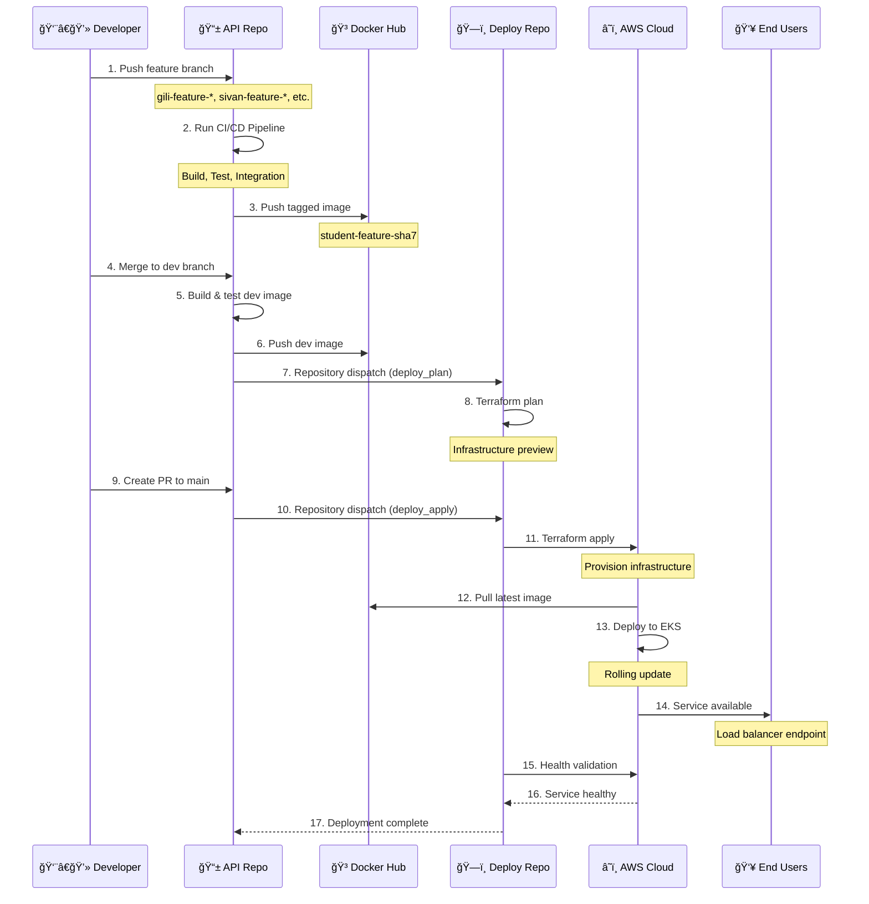
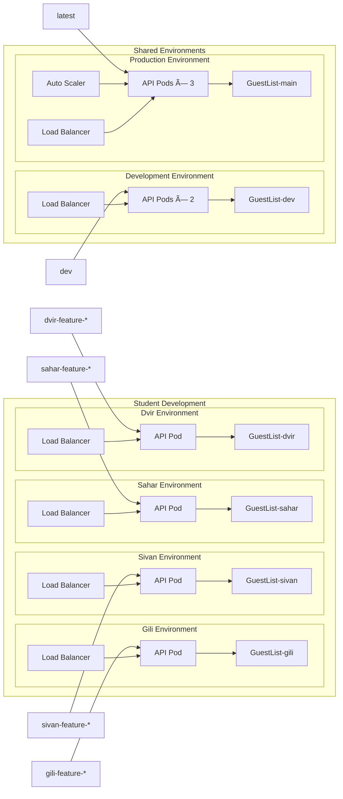

# 🎨 Guest List Project - Colorful Architecture Diagrams

This comprehensive visual guide shows the complete DevSecOps architecture with rich colors and detailed styling.

## 🌈 Complete System Architecture

```mermaid
graph TB
    %% Developer Input
    DEVELOPERS["👨‍💻 Development Team<br/>Gili, Sivan, Sahar, Dvir"]
    
    %% Code Repositories
    subgraph REPOS ["📚 GitHub Repositories"]
        API_REPO["📱 Guest-List-API<br/>Flask Application Code<br/>Docker & CI/CD"]
        DEPLOY_REPO["🏗️ Guest-List-Deploy<br/>Terraform Infrastructure<br/>Kubernetes Configs"]
    end
    
    %% CI/CD Process
    subgraph PIPELINE ["🔄 CI/CD Pipeline"]
        BUILD["🔨 Build & Test<br/>Docker Images<br/>API Testing"]
        TRIGGER["🔔 Cross-Repo Trigger<br/>Repository Dispatch<br/>Environment Selection"]
        DEPLOY["🚀 Infrastructure Deploy<br/>Terraform Apply<br/>Kubernetes Update"]
    end
    
    %% Container Registry
    REGISTRY["🐳 Docker Hub<br/>sivanmonshi/guestlistapi<br/>Image Tags by Environment"]
    
    %% AWS Cloud
    subgraph AWS ["☁️ AWS Cloud Infrastructure"]
        subgraph EKS_CLUSTER ["☸️ EKS Kubernetes Cluster"]
            PODS["🏃 API Pods<br/>Flask Application<br/>Auto-scaling"]
            LB_SVC["⚖️ Load Balancer<br/>External Access<br/>Health Checks"]
        end
        
        subgraph DATABASES ["📊 DynamoDB Tables"]
            STUDENT_DBS["👤 Student Environments<br/>GuestList-gili<br/>GuestList-sivan<br/>GuestList-sahar<br/>GuestList-dvir"]
            SHARED_DBS["🤝 Shared Environments<br/>GuestList-dev<br/>GuestList-staging<br/>GuestList-main"]
        end
    end
    
    %% Users
    USERS["👥 End Users<br/>Web Interface<br/>API Clients"]
    
    %% Flow connections
    DEVELOPERS ==> API_REPO
    DEVELOPERS ==> DEPLOY_REPO
    
    API_REPO ==> BUILD
    BUILD ==> REGISTRY
    BUILD ==> TRIGGER
    
    TRIGGER ==> DEPLOY
    DEPLOY_REPO ==> DEPLOY
    
    REGISTRY ==> PODS
    DEPLOY ==> EKS_CLUSTER
    DEPLOY ==> DATABASES
    
    LB_SVC ==> USERS
    PODS <==> STUDENT_DBS
    PODS <==> SHARED_DBS
    
    %% Styling
    classDef repoColor fill:#2D3748,stroke:#4A5568,stroke-width:3px,color:#FFFFFF,font-weight:bold
    classDef pipelineColor fill:#6B46C1,stroke:#553C9A,stroke-width:3px,color:#FFFFFF,font-weight:bold
    classDef awsColor fill:#FF9900,stroke:#E68900,stroke-width:3px,color:#FFFFFF,font-weight:bold
    classDef k8sColor fill:#326CE5,stroke:#2557CC,stroke-width:3px,color:#FFFFFF,font-weight:bold
    classDef dataColor fill:#DC2626,stroke:#B91C1C,stroke-width:3px,color:#FFFFFF,font-weight:bold
    classDef userColor fill:#059669,stroke:#047857,stroke-width:3px,color:#FFFFFF,font-weight:bold
    
    class API_REPO,DEPLOY_REPO,REGISTRY repoColor
    class BUILD,TRIGGER,DEPLOY pipelineColor
    class AWS awsColor
    class EKS_CLUSTER,PODS,LB_SVC k8sColor
    class DATABASES,STUDENT_DBS,SHARED_DBS dataColor
    class DEVELOPERS,USERS userColor
```

## 🔄 Environment Workflow Process

```mermaid
graph LR
    subgraph INDIVIDUAL ["👤 Individual Development"]
        GILI["🟢 gili-feature-*<br/>Personal Dev & Testing"]
        SIVAN["🔵 sivan-feature-*<br/>Personal Dev & Testing"]
        SAHAR["🟡 sahar-feature-*<br/>Personal Dev & Testing"]
        DVIR["🟣 dvir-feature-*<br/>Personal Dev & Testing"]
    end
    
    subgraph SHARED ["🤝 Shared Environments"]
        DEV["🔧 dev Environment<br/>🔄 Auto-deploy on push<br/>🧪 Integration Testing"]
        STAGING["🎭 staging Environment<br/>✋ Manual deployment<br/>📋 Pre-production Validation<br/>✅ Quality Assurance"]
        MAIN["🏭 main Environment<br/>🔄 Auto-deploy on PR merge<br/>🚀 Production Ready"]
    end
    
    %% Individual to Dev
    GILI ==>|"Merge PR"| DEV
    SIVAN ==>|"Merge PR"| DEV
    SAHAR ==>|"Merge PR"| DEV
    DVIR ==>|"Merge PR"| DEV
    
    %% Dev to Staging (Manual)
    DEV ==>|"Manual Deploy<br/>When ready for validation"| STAGING
    
    %% Staging to Main
    STAGING ==>|"PR Review & Merge<br/>After staging validation"| MAIN
    
    %% Styling
    classDef individualColor fill:#6366F1,stroke:#4F46E5,stroke-width:3px,color:#FFFFFF,font-weight:bold
    classDef devColor fill:#059669,stroke:#047857,stroke-width:3px,color:#FFFFFF,font-weight:bold
    classDef stagingColor fill:#D97706,stroke:#B45309,stroke-width:3px,color:#FFFFFF,font-weight:bold
    classDef prodColor fill:#DC2626,stroke:#B91C1C,stroke-width:3px,color:#FFFFFF,font-weight:bold
    
    class GILI,SIVAN,SAHAR,DVIR individualColor
    class DEV devColor
    class STAGING stagingColor
    class MAIN prodColor
```

## 🌈 Complete System Architecture

## 🌈 Multi-Environment Deployment View

## 🏗️ AWS Infrastructure Color-Coded View

## 🌍 Multi-Environment Architecture

## 🛠️ Technology Stack Rainbow

## 🔄 Workflow Process Flow

1. **Complete DevSecOps Pipeline**: From development to production
2. **Multi-Environment Support**: Individual and shared environments
3. **Infrastructure as Code**: Terraform-managed AWS resources
4. **Container Orchestration**: Kubernetes on EKS
5. **Automated CI/CD**: Cross-repository integration
6. **Security Best Practices**: IAM roles, network isolation, encryption
7. **Scalability**: Auto-scaling and load balancing
8. **Cost Optimization**: Resource-efficient configurations

The project showcases modern cloud-native development practices with comprehensive automation and professional-grade infrastructure management.
